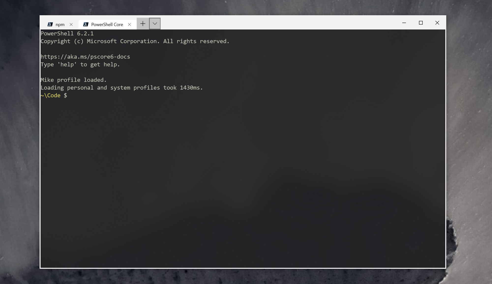

# Mike's Powershell profile: how to set up a terminal in Windows if you've been using *nix for 20 years

Heya. I've been using bash for about two decades before getting into Powershell. I'm a *nix person. I've worked at both Red Hat in the early days, IBM's dedicated Linux team, and a bunch of other places working with *nix as an sysadmin, SRE, Architect, and CTO. I now develop node and TypeScript while trying to make [verifying companies for EV HTTPS](https://certsimple.com/help/what-is-ev-ssl) less painful at [CertSimple](https://certsimple.com). 

**If you come from a Linux or Unix background, and want to use Powershell properly, this is the right place.** 

 - Better defaults, like UTF-8 output, long history, better tab completion, adding missing drives for registry hives, and a nice short prompt using the '~' character. See [defaults.ps1](defaults.ps1)
 - Implementations of popular Unix commands. See [unix.ps1](unix.ps1)
 - Useful commands for software development using git. See [development.ps1](development.ps1)
 - Useful commands and settings for node development. See [node.ps1](node.ps1)
 - Useful commands for crypto, including converting between different crypto file types, checking if private keys and certs match, etc. See [openssl.ps1](openssl.ps1)
 - Config files for [Windows Terminal](profiles.json), [Terminus](terminus-settings.yaml), and other modern Windows terminals.
 
The profile code itself contains useful implementations of common patterns - eg, installing packages, reading the registry, interacting with files and processes. **Learning the things required to make a profile you're happy with is a great way to get comfortable with Powershell.** 

The details below are minimal, but the names of most commands make things fairly obvious.

## Prerequisities for any *nix user who wants to use Powershell

This is what I install on any Windows 10 box.

### Powershell Core 6.2

[Powershell Core 6.2](https://docs.microsoft.com/en-gb/powershell/scripting/setup/Installing-PowerShell-Core-on-Windows?view=powershell-6) has a number of useful bits, but the main thing is it starts way faster than Powershell 5, so there's less lag when you open a new tab.

Powershell 6.2 includes PSReadline, which provides history with up/down arrows, ctrl left and right to move between words, and other useful keybindings you'll know from bash.

After install, make a shortcut to `"C:\Program Files\PowerShell\6\pwsh.exe" -nologo` and pin that to your taskbar. The `-nologo` makes Powershell skip some boring startup messages.

### For a decent, tabbed terminal

#### Tabbed terminals that work now

The terminals below all support:

 - Tabs
 - Readline
 - Right click paste
 - Copy on select
 
....and all the usual things you expect from any decent terminal emulator. I use **Windows Terminal**, which is in alpha right now, with a few workarounds for bugs. If you just want an awesome working terminal though, **Fluent Terminal** is a little older and works great out of the box.



 - [**Microsoft's official Windows Terminal**](https://www.microsoft.com/en-us/p/windows-terminal-preview/9n0dx20hk701) is in preview mode (settings is just a JSON file, copy on select doesn't work) but it's otherwise OK as a daily driver. 
 
```powershell
cp profiles.json $env:LOCALAPPDATA\Packages\Microsoft.WindowsTerminal_*\RoamingState\profiles.json
```

 - [**FluentTerminal**](https://github.com/felixse/FluentTerminal) is a native Windows 10 terminal that feels as if Microsoft had written it. It requires minimal configuration (just to add Powershell 6 to the profiles), has all the features you'd expect, and is fast. 
  - [**Terminus**](https://eugeny.github.io/terminus/) works great. Tweaking colors, keyboard shortcuts etc is easy via the menus, and [my settings file is included](terminus-settings.yaml) if you just want my config. 
  - [**Hyper**](https://hyper.is/) Install Hyper 3 and modify the config to set:
 ```
 shell: "C:\\Program Files\\PowerShell\\6\\pwsh.exe",
 ```
 
 and 
 
 ```
 shellArgs: [],
 ```
 
 To work around [issues with arrow keys](https://github.com/zeit/hyper/issues/2873) you'll also need to click **Edit**, **Preferences**, find **keymaps**, and replace the existing entries with one below:

```
  keymaps: {
    // Example
    // 'window:devtools': 'cmd+alt+o',
    "tab:new": "ctrl+t",
    // Also known as 'close tab'
    "pane:close": "ctrl+w",
    // This is a poor default, as these are used to navigate between words
    // "tab:next": ["ctrl+right"],
    // "tab:prev": ["ctrl+left"],
    // Bug workaround for https://github.com/zeit/hyper/issues/2873
    "editor:movePreviousWord": "",
    "editor:moveNextWord": ""
  }
 ```
 
#### Minimal terminals

The following apps are console window only - they don't provide tabs, graphical config tools, etc. You can add  an app like [Groupy](https://www.stardock.com/products/groupy/) to them to make a tabbed terminal, but they require more setup than just using Terminus. 

 - The **inbuilt Powershell 6 terminal**
 - [**Alacritty**](https://github.com/jwilm/alacritty) is fast. You'll also need to have the following in `AppData\Roaming\alacritty\alacritty.yml`
 
```yaml
    shell:
        program: 'C:\Program Files\PowerShell\6\pwsh.exe'
   
    enable_experimental_conpty_backend: true
```    

#### Terminal apps that don't yet work on Windows

The apps below all plan on having Windows support in future, but don't yet properly work at the time of writing. There are links to the tracking bugs below.


 - [**Upterm**](https://github.com/railsware/upterm) [doesn't yet work on Windows](https://github.com/railsware/upterm/issues/800
)

#### Not a terminal

[cmder](http://cmder.net/)'s website makes it seems like it's a new terminal, but cmder is just ConEmu and some additional things you may already have installed and some other things you don't want (like `cmd` tools).

#### Old-style Win32 apps

These have the 'everything at once' UI design of older Windows operating systems.

 - [**ConEmu**](https://conemu.github.io/) works, but has some contrast issues which make it hard to see the open tab, and is hampered by its author's desire for Windows XP support. 
 - [**ConsoleZ**](https://github.com/cbucher/console) is an updated version of the now-unmaintained Console2.

### Trust PSGallery

To allow you to install items without further prompts:

	Set-PSRepository -name PSGallery -InstallationPolicy Trusted

### For 'less' and a bunch of other useful stuff

Get the [Powershell Community Extensions](https://github.com/Pscx/Pscx). Run:

	Install-Module Pscx -Scope CurrentUser
	
AllowClobber is needed due to [this bug](https://github.com/Pscx/Pscx/issues/15)	

### For 'Remove-ItemSafely' - ie, trashing files from the command line

Run:

	Install-Module -Name Recycle -Scope CurrentUser

### To pick a color scheme / theme

Browse [iterm2colorschemes.com](https://iterm2colorschemes.com/) and download the equivalent named Windows Terminal file from [their Windows Terminal color schemes](https://github.com/mbadolato/iTerm2-Color-Schemes/tree/master/windowsterminal). Open **Settings** and paste it into the `schemes` section, then select that scheme name for the profile you want to use it with in `profiles`.

Terminus has it's own color schemes, just open **Settings** > **Appearance** > **Color Scheme** and pick one (or use my config file).

[ColorTool](https://blogs.msdn.microsoft.com/commandline/2017/08/11/introducing-the-windows-console-colortool/) also supports importing the well know `.itermcolors` format. [Download ColorTool from Microsoft's GitHub](https://github.com/Microsoft/console/tree/master/tools/ColorTool). You can edit an `.itermcolors` file using [terminal.sexy](https://terminal.sexy). 

Run:

	./colortool -b color-scheme.itermcolors

### For OpenSSH

OpenSSH now comes with Windows. **Settings** -> **Manage Optional Features** -> **OpenSSH client**. 

### For a nice prompt

By default `$prompt` is a minimal, bash-style prompt with a truncated path. If you're feeling fancier, you can install [oh-my-posh](https://github.com/JanDeDobbeleer/oh-my-posh).

### For OpenSSL (if you need it)

Personally I use OpenSSL for viewing private keys, pubkeys, certificates, and other TLS/PKI work. Unless you do the same you probably don't need OpenSSL. 

The Windows version of OpenSSH uses Windows CryptoAPI rather than OpenSSL, so if you want to add OpenSSL, you'll have to install it.

Use [this up to date, secure Windows OpenSSL build](https://indy.fulgan.com/SSL/). 

### For host, dig and other DNS tools

Download [Bind 9 for Windows](https://www.isc.org/downloads/). Extract the zip and run `BINDinstall.exe` as Administrator. Select 'Tools Only'.

### If you want a better 'select-string' (aka grep)

The [Find-String](https://github.com/drmohundro/Find-String) module adds match highlighting and other fun things. For me the inbuilt `select-string` is enough.

	Install-Module -Name Find-String -Scope CurrentUser

### If you use node

Start [Powershell 5](https://github.com/felixrieseberg/windows-build-tools/issues/136) as admin and run:

	npm install -g windows-build-tools

## Minimum Powershell concepts to learn before you rant about how much you hate Powershell

These come with powershell. If you don't know them you're the equivalent of someone who doesn't know `grep` ranting about how "Unix is like DOS". That might be painful to hear but it's true. 

`select` (also called `select-object`) - select the fields you want on an object

`get-member` - show the properties and methods of an object

`get-itemproperty` - show the properties of registry objects (`ls` only shows children)

`where` (also called `where-object`) - choose items matching some criteria.

`get-help some-command -examples` - every command has examples.

## How does Powershell actually differ from bash, day-to-day?

Here's a real comparison: [a bash script used to find a compromised node module a little while ago](https://twitter.com/feross/status/1017481175005257728): 

	find . -type d -name "eslint-scope" -print0 | xargs -n 1 -0 -I % sh -c "(cat %/package.json | npx json version) && echo '(at %)'"

Here's [a Powershell version](https://twitter.com/mikemaccana/status/1017774238344900608). This is written using Unix aliases as that's what folk are familiar with, though it's generally considered better to use the full names in your scripts:

	$results = @{} 
	ls -recurse -filter "eslint-scope" | foreach { 
		$file = "${PSItem}\package.json" 
		$version = cat $file | convertfrom-json | select -ExpandProperty version 
		$results.Add($file,$version) } 
	echo $results | format-list

You might prefer one or the other, but the important difference:

 - Powershell has real objects. We're creating a hashmap of `$file`,`$version` pairs.
 - In Powershell we `select` the keys whose values we want, rather than scraping with regexs
 - Powershell seperates content from presentation, so we can format our `$results` however we want
 - Powershell has inbuilt tools to parse JSON (and CSV, and Excel, and other common formats). It can make them too.

### Why Windows filesystem is slow

Filesystem access under Windows is undoubtably slower than ext3/4 for most tasks. See https://github.com/Microsoft/WSL/issues/873#issuecomment-425272829 for more details about why and some performance hints to speed things up. There's also [plans to improve things in future](https://twitter.com/shanselman/status/1123467067880038400).

## Included commands

### Stuff that should be there out of the box

`edit` - edits a file (using VSCode insiders, but modify as you please)

`open` - open a file using associated app

`settings` - the Windows Settings app

`explorer` - file explorer

### File management

`expand-archive` - also called `unzip`

`find-file`

`show-links`

## OS management

`reboot`

`get-windows-build` 

`disable-windows-search` - Windows Search Indexer doesn't handle filesystems with lots of small files - the 'Windows Search Indexer' process will kick in when you're working, and make interactive so slow you'll be waiting for your keyboard strokes to appear on screen. I've [discussed this with Rich Tuner from Microsoft](https://twitter.com/felixfbecker/status/1047745804444815360) who says the search team are working on fixing this, but right now I suggest you disable the indexer. 

You can still search for files without the Indexer, it'll just not using the indexes, so take a little longer. You can also just use `find-file` included here.

`get-serial-number`

### Unix like commands

`grep`

`grepv`

`df`

`sed`

`edit-recursive` - `sed` but recursive

`fuser`

`pkill`

`pgrep`

`touch`

`file`

`sudo` - note command after `sudo` must be quoted

`uptime`

`cut`

`export`

`ln`

`pstree`

`which`

`find`

## Powershell stuff


`prompt` - a nice Unixlike prompt with ~ style truncation for the home directory

`edit-powershell-profile`

`update-powershell-profile` - re-run your profile

`set-title` - set the window title

`get-path` - get the PATH, one item per line

## Development

`get-git-ignored`

`get-git-untracked`

`gg` - A `git grep` Alias

`yarn` - Yarn wrapper with `yarn ls` re-added, since I hate typing `yarn list`

`sourcetree` - SourceTree

### Crypto


`read-certificate`

`read-csr`

`read-rsa-key`

`read-rsa-key`

`read-ecc-key`

`read-pkcs12`

`test-openssl-client`

`convert-pem-to-p12`

`convert-p12-to-pem`

`convert-crt-to-pem`

`show-rsa-certificate-modulus`

`show-ecdsa-certificate-ppv-and-curve`

`show-rsa-key-modulus`

`show-ecc-key-ppv-and-curve`

`show-rsa-csr-modulus`

`protect-file`

`unprotect-file`

`convert-key-to-hpkp-pin`

`convert-website-to-hpkp-pin`
